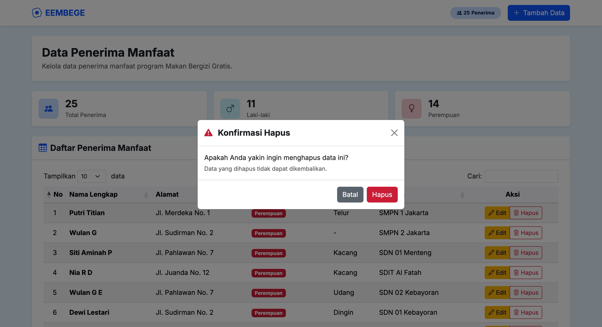

# 🍳 EEMBEGE — Simple CRUD Data Penerima Manfaat MBG

## Tugas 2 Praktikum

Aplikasi web sederhana untuk mengelola data **Penerima Manfaat Program Makan Bergizi Gratis (MBG)**. Dibangun menggunakan Express.js, Bootstrap 5, jQuery DataTables, dan SQLite.

---

## 📋 Deskripsi

EEMBEGE adalah sistem CRUD (Create, Read, Update, Delete) yang memungkinkan pengguna untuk:

- **Menambah** data penerima manfaat baru
- **Melihat** daftar penerima manfaat dengan fitur pencarian dan paginasi (DataTables server-side)
- **Mengedit** data penerima manfaat yang sudah ada
- **Menghapus** data penerima manfaat dengan konfirmasi modal
- **Melihat statistik** jumlah penerima berdasarkan jenis kelamin

---

## 🛠️ Tech Stack

| Teknologi | Keterangan |
|-----------|------------|
| **Node.js + Express** | Backend server & REST API |
| **better-sqlite3** | Database SQLite |
| **Bootstrap 5** | UI framework & responsive design |
| **jQuery DataTables** | Tabel interaktif dengan server-side processing |
| **Select2** | Input alergi dengan autocomplete |
| **AJAX** | Komunikasi asinkron client-server |

---

## 📁 Struktur Proyek

```
simple-crud/
├── data/                  # Database SQLite (auto-generated)
├── output/                # Screenshot output aplikasi
├── public/
│   ├── index.html         # Halaman utama (daftar penerima)
│   ├── form.html          # Halaman form tambah/edit
│   ├── app.js             # Logic halaman utama
│   ├── form.js            # Logic halaman form
│   └── styles.css         # Custom styles
├── Slide Presentasi.pdf   # Slide presentasi tugas
├── server.js              # Express server & API endpoints
├── package.json
└── README.md
```

---

## 🚀 Cara Menjalankan

### Prasyarat

- [Node.js](https://nodejs.org/) (v18 atau lebih baru)

### Instalasi

```bash
# Clone repository
git clone <repository-url>
cd simple-crud

# Install dependencies
npm install

# Jalankan server
npm start
```

Server akan berjalan di **http://127.0.0.1:3000**

---

## 📡 API Endpoints

| Method | Endpoint | Keterangan |
|--------|----------|------------|
| `GET` | `/api/penerima-manfaat` | Ambil semua data |
| `POST` | `/api/penerima-manfaat/datatable` | Data untuk DataTables (server-side) |
| `GET` | `/api/penerima-manfaat/:id` | Ambil data berdasarkan ID |
| `POST` | `/api/penerima-manfaat` | Tambah data baru |
| `PUT` | `/api/penerima-manfaat/:id` | Update data |
| `DELETE` | `/api/penerima-manfaat/:id` | Hapus data |
| `GET` | `/api/statistik` | Ambil statistik penerima |
| `GET` | `/api/alergi` | Ambil daftar alergi (autocomplete) |

---

## 📸 Screenshot Output

### Halaman Utama — DataTable & Statistik


### Form Tambah Data


### Form Edit Data


### Konfirmasi Hapus Data


---

## 📽️ Video Demo

<a href="https://drive.google.com/file/d/1YfbK9_iLRSveCTP3c92de8bP_GncsHy6/view">
  
</a>

---

## 📊 Slide Presentasi

Slide presentasi tersedia pada file [`Slide Presentasi.pdf`](Slide%20Presentasi.pdf) di dalam repository ini.

---

## 📝 Skema Database

```sql
CREATE TABLE penerima_manfaat (
  id           TEXT PRIMARY KEY,
  namaLengkap  TEXT NOT NULL,
  alamat       TEXT NOT NULL,
  jenisKelamin TEXT NOT NULL CHECK(jenisKelamin IN ('Laki-laki', 'Perempuan')),
  alergi       TEXT NOT NULL,
  sekolah      TEXT NOT NULL,
  createdAt    TEXT NOT NULL DEFAULT (datetime('now')),
  updatedAt    TEXT NOT NULL DEFAULT (datetime('now'))
);
```

---

## 🧑‍💻 Fitur Utama

- CRUD lengkap dengan validasi server-side & client-side
- DataTables server-side processing (search, sort, pagination)
- Statistik real-time (total, laki-laki, perempuan)
- Select2 autocomplete untuk input alergi
- Konfirmasi hapus dengan modal Bootstrap
- Responsive design (mobile-friendly)
- UUID sebagai primary key

