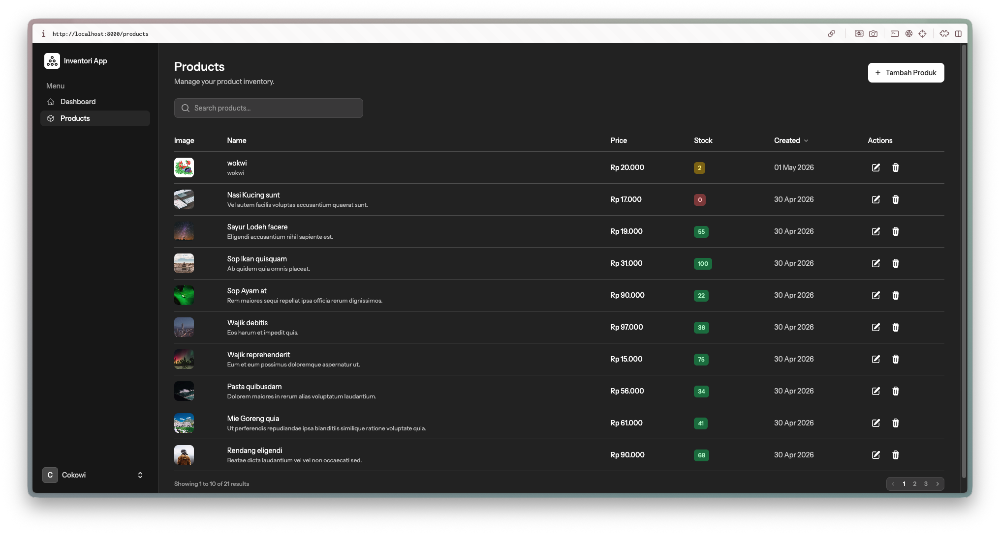
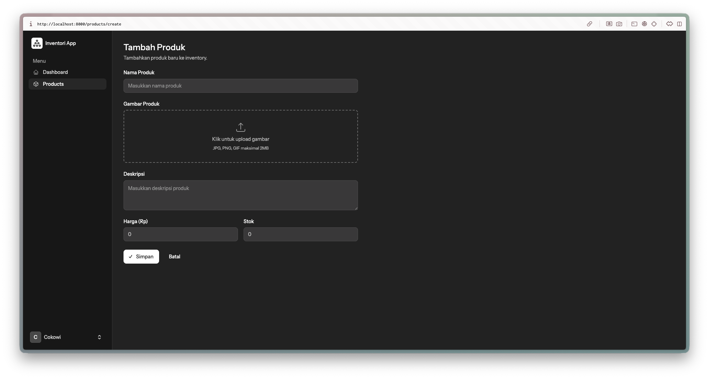
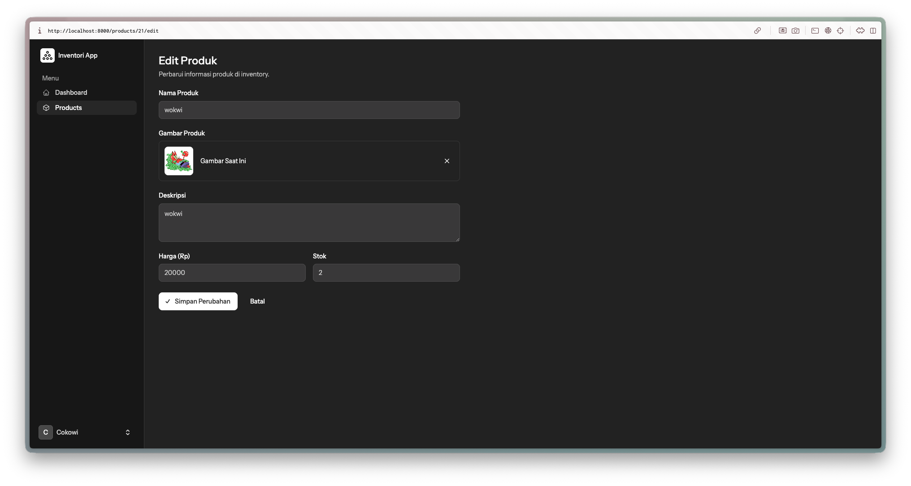
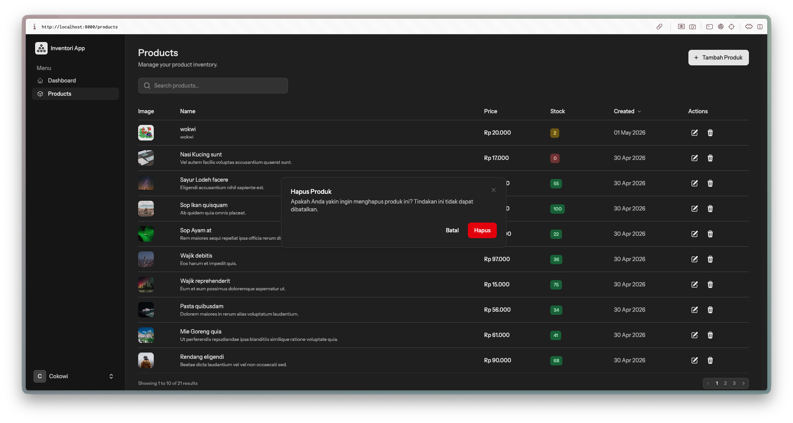

# COTS Laravel - Sistem Inventori Produk

Aplikasi web manajemen produk berbasis **Laravel 13** dengan antarmuka reaktif menggunakan **Livewire 4** dan komponen UI dari **Flux UI**. Dibangun sebagai proyek tugas mata kuliah ABP (Splikasi Berbasis Platform).

---

## Daftar Isi

- [Tech Stack](#tech-stack)
- [Fitur Utama](#fitur-utama)
- [Struktur Database](#struktur-database)
- [Arsitektur Aplikasi](#arsitektur-aplikasi)
- [Instalasi](#instalasi)
- [Menjalankan Aplikasi](#menjalankan-aplikasi)
- [Seeding Data](#seeding-data)
- [Testing](#testing)
- [Screenshot](#screenshot)
- [Rute Aplikasi](#rute-aplikasi)
- [Struktur Direktori](#struktur-direktori)

---

## Tech Stack

| Kategori | Teknologi | Versi |
|---|---|---|
| Framework | Laravel | 13.x |
| Frontend Reaktif | Livewire | 4.x |
| UI Components | Flux UI | 2.x |
| CSS Framework | Tailwind CSS | 4.x |
| Autentikasi | Laravel Fortify | 1.x |
| Database | SQLite | - |
| Testing | Pest PHP | 4.x |
| Code Style | Laravel Pint | 1.x |
| Build Tool | Vite | - |

---

## Fitur Utama

### Autentikasi
- Login dan registrasi pengguna
- Reset password via email
- Verifikasi email
- Two-Factor Authentication (2FA/TOTP)
- Manajemen profil dan keamanan akun

### Manajemen Produk (CRUD)
- **Daftar Produk** -- Tabel dengan pagination, pencarian real-time, dan pengurutan kolom
- **Tambah Produk** -- Form dengan upload gambar (drag & drop), validasi input
- **Edit Produk** -- Form edit dengan kemampuan mengganti atau menghapus gambar
- **Hapus Produk** -- Konfirmasi hapus melalui modal dialog, otomatis menghapus file gambar terkait

### Dashboard
- Statistik total produk dengan navigasi langsung ke halaman produk

---

## Struktur Database

### Tabel `products`

| Kolom | Tipe | Keterangan |
|---|---|---|
| `id` | bigint (PK) | Primary key, auto-increment |
| `name` | string | Nama produk (wajib) |
| `image` | string (nullable) | Path file gambar di storage |
| `description` | text (nullable) | Deskripsi produk |
| `price` | integer | Harga produk dalam Rupiah |
| `stock` | integer | Jumlah stok (default: 0) |
| `created_at` | timestamp | Waktu pembuatan |
| `updated_at` | timestamp | Waktu pembaruan terakhir |

### Model `Product`

```php
class Product extends Model
{
    use HasFactory;

    protected $fillable = [
        'name',
        'image',
        'description',
        'price',
        'stock',
    ];
}
```

---

## Arsitektur Aplikasi

Aplikasi ini menggunakan arsitektur **Controller + Class-based Livewire Component**. Route ditangani oleh `ProductController` yang me-render view berisi komponen Livewire class-based.

### Controller

| Method | Deskripsi |
|---|---|
| `ProductController@index` | Render halaman daftar produk |
| `ProductController@create` | Render halaman tambah produk |
| `ProductController@edit` | Render halaman edit produk |

### Komponen Livewire

| Class | View | Deskripsi |
|---|---|---|
| `App\Livewire\Products\ProductIndex` | `livewire/products/product-index.blade.php` | Tabel produk dengan pencarian, pengurutan, dan hapus |
| `App\Livewire\Products\ProductCreate` | `livewire/products/product-create.blade.php` | Form pembuatan produk baru dengan upload gambar |
| `App\Livewire\Products\ProductEdit` | `livewire/products/product-edit.blade.php` | Form edit produk dengan manajemen gambar |

### Alur Upload Gambar

1. Pengguna memilih file melalui dropzone atau file browser
2. Livewire `WithFileUploads` mengunggah file secara temporary
3. Preview gambar ditampilkan sebelum disimpan
4. Saat submit, file disimpan ke `storage/app/public/products/`
5. Symlink `public/storage` mengarah ke `storage/app/public`

### Penampilan Gambar pada Tabel

Gambar ditampilkan dengan logika fallback:
- Jika file ditemukan di storage, diakses melalui `Storage::url()`
- Jika tidak ditemukan (misalnya URL eksternal dari seeder), ditampilkan langsung sebagai URL

---

## Instalasi

### Prasyarat

- PHP >= 8.3
- Composer
- Node.js & NPM
- SQLite

### Langkah Instalasi

```bash
# 1. Clone repository
git clone <repository-url>
cd cots-laravl

# 2. Jalankan setup otomatis
composer setup
```

Script `composer setup` akan menjalankan:
- `composer install` -- instalasi dependency PHP
- Copy `.env.example` ke `.env`
- `php artisan key:generate` -- generate application key
- `php artisan migrate` -- migrasi database
- `npm install` -- instalasi dependency JavaScript
- `npm run build` -- build asset frontend

### Konfigurasi Manual (jika diperlukan)

```bash
# Buat file database SQLite
touch database/database.sqlite

# Buat symlink storage
php artisan storage:link
```

---

## Menjalankan Aplikasi

```bash
# Mode development (server, queue, logs, dan vite sekaligus)
composer run dev
```

Perintah ini akan menjalankan 4 proses secara bersamaan:
- **Server** -- `php artisan serve` (http://localhost:8000)
- **Queue** -- `php artisan queue:listen`
- **Logs** -- `php artisan pail`
- **Vite** -- `npm run dev` (hot module replacement)

---

## Seeding Data

```bash
# Seed 20 data produk dummy
php artisan db:seed --class=ProductSeeder
```

Data dummy di-generate menggunakan:
- `faker-restaurant` - nama makanan/minuman Indonesia
- `mmo/faker-images` - gambar placeholder dari Picsum

---

## Testing

Aplikasi ini menggunakan **Pest PHP** untuk testing. Berikut test suite yang tersedia:

### Test Suite Produk

| File Test | Skenario |
|---|---|
| `ProductIndexTest` | Proteksi auth, render halaman, pencarian produk |
| `ProductCreateTest` | Proteksi auth, render form, pembuatan produk dengan/tanpa gambar, validasi |
| `ProductEditTest` | Proteksi auth, render form, update produk, ganti gambar, hapus gambar |
| `ProductDeleteTest` | Hapus produk, penghapusan file gambar terkait |

### Menjalankan Test

```bash
# Semua test
php artisan test --compact

# Test spesifik
php artisan test --compact --filter=ProductIndexTest

# Test dengan coverage
php artisan test --compact tests/Feature/ProductCreateTest.php
```

### Code Style

```bash
# Format kode
vendor/bin/pint --dirty --format agent
```

---

## Screenshot

### Daftar Produk

Halaman utama manajemen produk menampilkan tabel dengan fitur pencarian, pengurutan, pagination, dan aksi edit/hapus per baris.



### Tambah Produk

Form untuk menambahkan produk baru dengan field nama, upload gambar (dropzone), deskripsi, harga, dan stok.



### Edit Produk

Form edit produk yang sudah terisi data existing, dengan opsi untuk mengganti atau menghapus gambar.



### Konfirmasi Hapus

Modal konfirmasi yang muncul saat pengguna menekan tombol hapus pada tabel produk.



---

## Routes Aplikasi

### Route Publik

| Method | URI | Nama | Deskripsi |
|---|---|---|---|
| GET | `/` | `home` | Landing page |
| GET | `/login` | `login` | Halaman login |
| GET | `/register` | `register` | Halaman registrasi |

### Route Terautentikasi

| Method | URI | Nama | Controller | Deskripsi |
|---|---|---|---|---|
| GET | `/dashboard` | `dashboard` | View | Dashboard utama |
| GET | `/products` | `products.index` | `ProductController@index` | Daftar produk |
| GET | `/products/create` | `products.create` | `ProductController@create` | Form tambah produk |
| GET | `/products/{product}/edit` | `products.edit` | `ProductController@edit` | Form edit produk |

### Route Pengaturan

| Method | URI | Nama | Deskripsi |
|---|---|---|---|
| GET | `/settings/profile` | `settings.profile` | Pengaturan profil |
| GET | `/settings/security` | `settings.security` | Pengaturan keamanan |
| GET | `/settings/appearance` | `settings.appearance` | Pengaturan tampilan |

---

## Struktur Direktori

```
cots-laravl/
├── app/
│   ├── Http/Controllers/
│   │   └── ProductController.php    # Controller produk (index, create, edit)
│   ├── Livewire/Products/
│   │   ├── ProductIndex.php         # Komponen daftar produk
│   │   ├── ProductCreate.php        # Komponen tambah produk
│   │   └── ProductEdit.php          # Komponen edit produk
│   └── Models/
│       └── Product.php              # Model produk
├── database/
│   ├── factories/
│   │   └── ProductFactory.php       # Factory untuk data dummy
│   ├── migrations/
│   │   └── ..._create_products_table.php
│   └── seeders/
│       └── ProductSeeder.php        # Seeder 20 data produk
├── resources/views/
│   ├── dashboard.blade.php          # Dashboard dengan statistik
│   ├── layouts/
│   │   └── app/
│   │       └── sidebar.blade.php    # Navigasi sidebar
│   ├── products/
│   │   ├── index.blade.php          # View controller → Livewire component
│   │   ├── create.blade.php         # View controller → Livewire component
│   │   └── edit.blade.php           # View controller → Livewire component
│   └── livewire/products/
│       ├── product-index.blade.php   # Template tabel produk
│       ├── product-create.blade.php  # Template form tambah
│       └── product-edit.blade.php    # Template form edit
├── routes/
│   └── web.php                      # Definisi rute (ProductController)
├── storage/
│   └── app/public/products/         # File gambar produk
├── tests/Feature/
│   ├── ProductIndexTest.php
│   ├── ProductCreateTest.php
│   ├── ProductEditTest.php
│   └── ProductDeleteTest.php
└── output/                          # Screenshot dokumentasi
    ├── list_produk.png
    ├── tambah_produk.png
    ├── edit_produk.png
    └── confirm_delete.png
```

---


