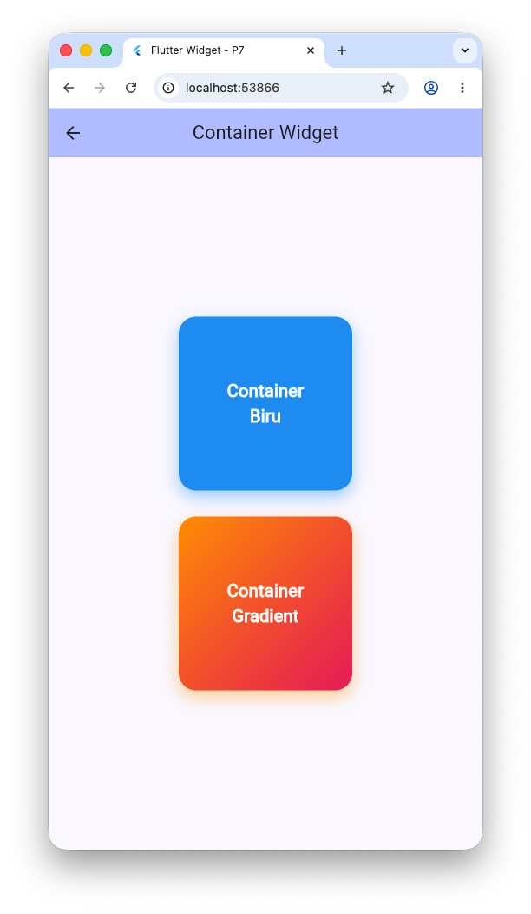
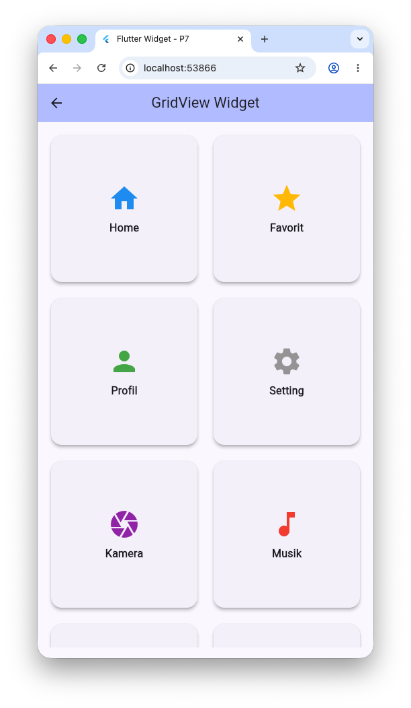
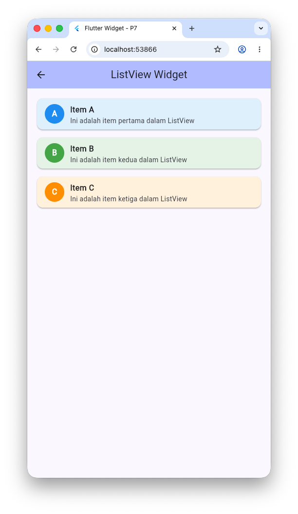
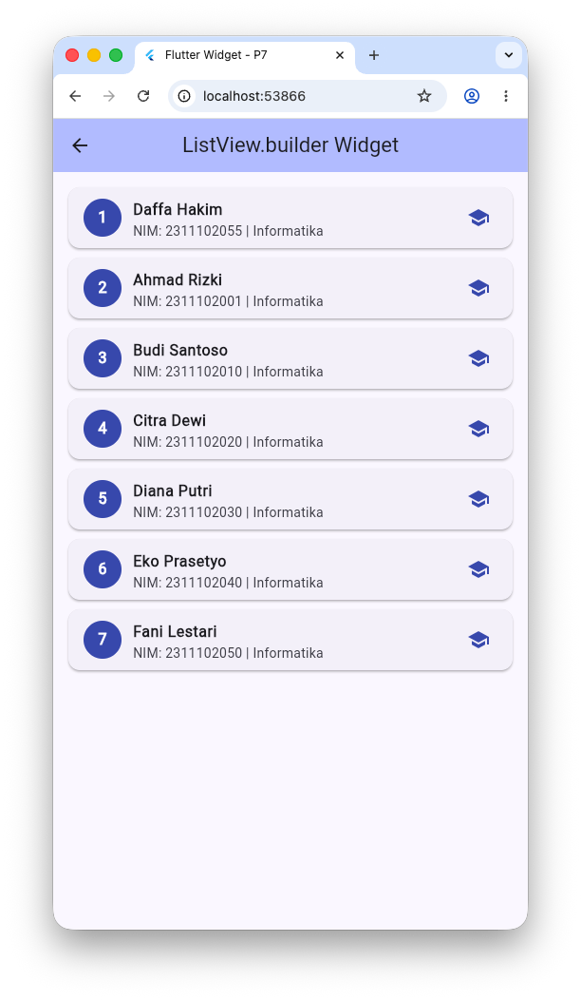
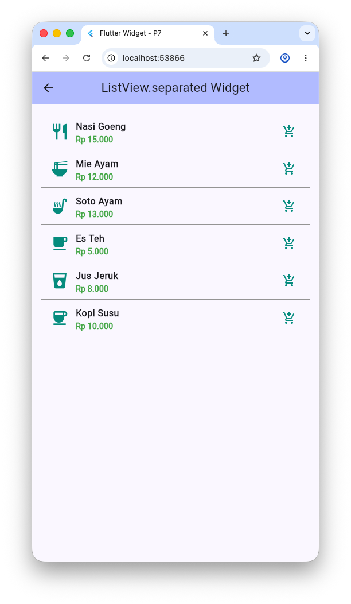
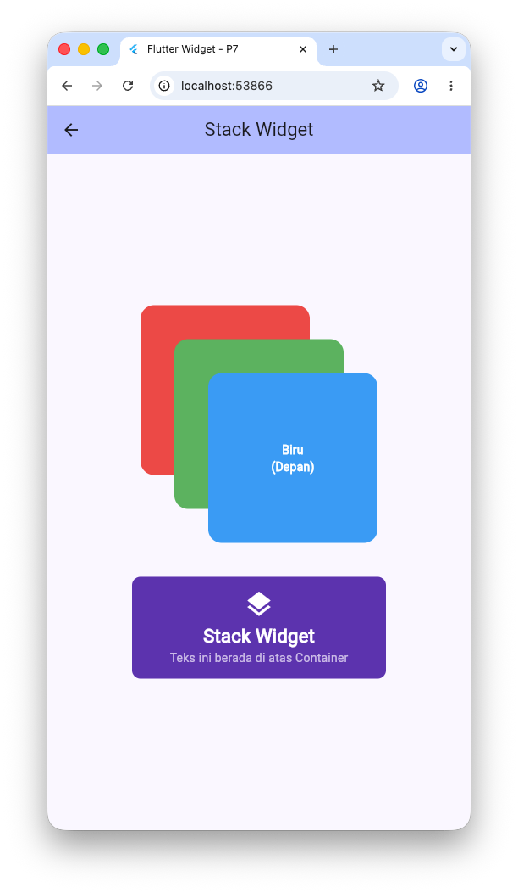

# Flutter Widget - Pertemuan 7

## Struktur Project

```
lib/
├── main.dart                          → Halaman utama (menu navigasi)
└── pages/
    ├── container_page.dart            → Demo Container
    ├── gridview_page.dart             → Demo GridView
    ├── listview_page.dart             → Demo ListView
    ├── listview_builder_page.dart     → Demo ListView.builder
    ├── listview_separated_page.dart   → Demo ListView.separated
    └── stack_page.dart                → Demo Stack
```

---

## Widget yang Digunakan

### 1. Container

Widget dasar yang digunakan untuk membuat kotak/box dengan dekorasi. Container dapat diatur ukuran (`width`, `height`), warna (`color`), border radius, shadow, dan gradient. Pada contoh ini ditampilkan dua Container: satu berwarna biru solid dan satu dengan gradient orange-pink.



---

### 2. GridView

Widget untuk menampilkan item dalam bentuk grid (baris dan kolom). Menggunakan `GridView.builder` dengan `SliverGridDelegateWithFixedCrossAxisCount` untuk mengatur jumlah kolom. Pada contoh ini ditampilkan 8 item menu dalam grid 2 kolom, masing-masing berisi icon dan label.



---

### 3. ListView

Widget untuk menampilkan daftar item secara vertikal (scrollable). ListView dasar menerima children secara langsung (statis). Pada contoh ini ditampilkan 3 item (A, B, C) masing-masing di dalam Card dengan CircleAvatar, judul, dan subtitle.



---

### 4. ListView.builder

Varian ListView yang membangun item secara lazy (on-demand) berdasarkan data array. Lebih efisien untuk list panjang karena hanya me-render item yang terlihat di layar. Pada contoh ini digunakan untuk menampilkan daftar mahasiswa dari array `List<Map<String, dynamic>>`.



---

### 5. ListView.separated

Varian ListView yang secara otomatis menambahkan separator/pembatas di antara setiap item. Menggunakan `separatorBuilder` untuk mendefinisikan widget pembatas (contoh: `Divider`). Pada contoh ini digunakan untuk menampilkan daftar menu makanan dengan garis pembatas antar item.



---

### 6. Stack

Widget yang memungkinkan penumpukan (overlay) beberapa widget di atas satu sama lain. Widget yang ditulis terakhir akan tampil paling depan. Menggunakan `Positioned` untuk mengatur posisi masing-masing child. Pada contoh ini ditampilkan 3 kotak bertumpuk (merah, hijau, biru) dan teks yang di-overlay di atas Container bergradient.



---

## Cara Menjalankan

```bash
flutter pub get
flutter run
```
